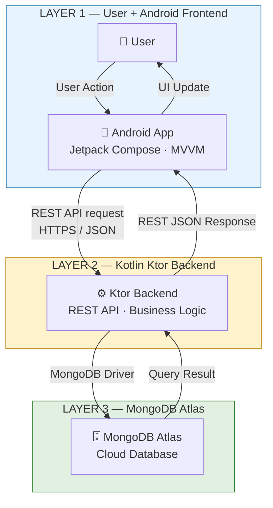

# Smart Grocery App — System Design
## 1. Architecture Overview

This document set describes the **system design** of the Smart Grocery App — a native
Android grocery shopping application. It is organized into three horizontal layers:

- **Layer 1 — User + Android Frontend** (Kotlin, Jetpack Compose)
- **Layer 2 — Kotlin Ktor Backend** (REST API, business logic)
- **Layer 3 — MongoDB Atlas** (cloud NoSQL database)

The Android app **never** talks to MongoDB directly. All data access goes through the
Ktor REST API over HTTPS/JSON, and the backend talks to MongoDB Atlas via the
MongoDB Driver.

No microservices, Redis, Kafka, Docker, Kubernetes, payment gateways, admin
dashboards, or push notifications are part of this design — these are documented
as future enhancements only.

---

## 2. High-Level Architecture Diagram

**Request direction:** User → Android App → REST API (HTTPS/JSON) → Ktor Backend → MongoDB Driver → MongoDB Atlas

**Response direction:** MongoDB Atlas → Ktor Backend → REST JSON Response → Android App → UI

---

## 3. Technology Stack

| Layer | Technology |
|---|---|
| Frontend | Kotlin, Jetpack Compose, Material Design 3, Navigation Compose, ViewModel (MVVM), StateFlow |
| Backend | Kotlin, Ktor Framework, REST API (JSON over HTTP), Kotlin Serialization, Coroutines |
| Database | MongoDB Atlas, MongoDB Driver |
| Tooling | Android Studio, Git & GitHub, Postman, MongoDB Compass (optional) |

---

## 4. Architecture Rule (Separation of Responsibilities)

| Layer | Responsibility |
|---|---|
| Android Frontend | User interface and client-side state |
| Ktor Backend | API handling and application/business logic |
| MongoDB Atlas | Persistent data storage |

> The Android app communicates with MongoDB **only indirectly**, through the Ktor REST API.

---

## 5. Document Index

| File | Contents |
|---|---|
| `01_architecture_overview.md` | This file — high-level architecture |
| `02_frontend_design.md` | Android frontend layer design |
| `03_backend_design.md` | Ktor backend layer + API modules |
| `04_database_design.md` | MongoDB Atlas collections & relationships |
| `05_system_flows.md` | Detailed flow diagrams (auth, browsing, cart, orders, profile, errors) |
