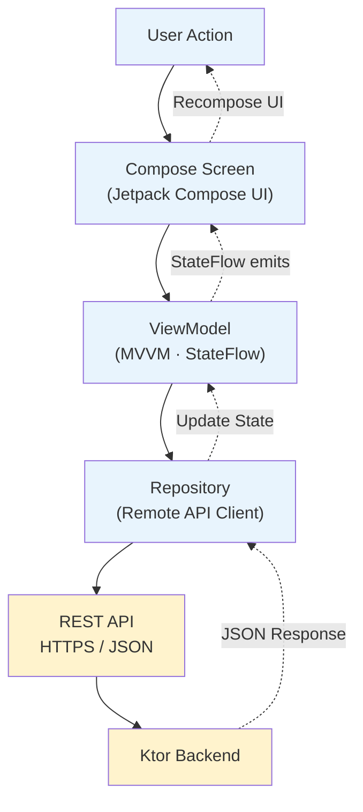
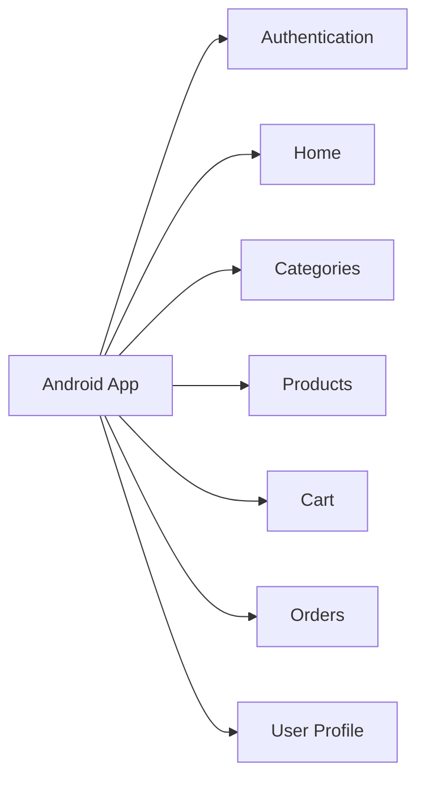

# Smart Grocery App — System Design
## 2. Android Frontend (Presentation / Client Layer)

The Android app is the presentation and client-side state layer. It communicates with
the backend exclusively via the REST API — it holds no direct database access.

### Conceptual Flow (Client Side)

### Internal Structure

- **Jetpack Compose UI** — declarative screens
- **Screens** — Authentication, Home, Categories, Products, Cart, Orders, User Profile
- **ViewModels** — one per screen/feature, expose `StateFlow` of UI state
- **Repositories** — abstract the remote API client from ViewModels
- **Remote API Client** — issues REST calls to the Ktor backend

### Major Application Features (Screens)

> The frontend diagram is intentionally kept high-level — its purpose is to show
> **how the client communicates with the backend**, not internal Compose widget trees.
