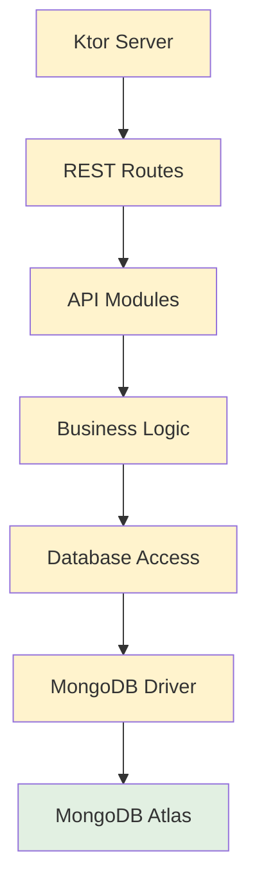

# Smart Grocery App — System Design
## 3. Kotlin Ktor Backend (Business / Application Layer)

The backend is the business/application layer. It receives REST requests, executes
business logic, and accesses MongoDB Atlas through the MongoDB Driver.

### Internal Backend Flow

### Backend API Modules

```mermaid
flowchart TB
    M["API Modules"] --> AUTH["Authentication API"]
    M --> CAT["Category API"]
    M --> PROD["Product API"]
    M --> CART["Cart API"]
    M --> ORD["Order API"]
    M --> USER["User API"]

    AUTH --> AUTH1["Registration"]
    AUTH --> AUTH2["Login"]
    AUTH --> AUTH3["Logout"]
    AUTH --> AUTH4["Session / token management"]

    CAT --> CAT1["Get grocery categories"]

    PROD --> PROD1["Product listing"]
    PROD --> PROD2["Product details"]
    PROD --> PROD3["Product search"]
    PROD --> PROD4["Category filtering"]

    CART --> CART1["Add item"]
    CART --> CART2["Remove item"]
    CART --> CART3["Update quantity"]
    CART --> CART4["Get cart"]

    ORD --> ORD1["Place order"]
    ORD --> ORD2["Order history"]
    ORD --> ORD3["Order details"]
    ORD --> ORD4["Order status"]

    USER --> USER1["User profile"]
    USER --> USER2["User information"]
    USER --> USER3["Delivery address"]
```

### Module Responsibility Table

| Module | Responsibility |
|---|---|
| Authentication API | Registration, login, logout, session/token management |
| Category API | Serves the list of grocery categories |
| Product API | Product listing, details, search, filtering |
| Cart API | Add / remove / update operations on the user's cart |
| Order API | Order placement, history, and status updates |
| User API | Manages user profile data |

All modules pass through the shared **Business Logic** and **Database Access** layers
before reaching MongoDB Atlas via the MongoDB Driver.

> Authentication/session/token management is handled inside the Authentication API.
> No specific auth technology (e.g. JWT) is assumed beyond what's documented in the
> proposal — this stays at the conceptual "session/token management" level.
