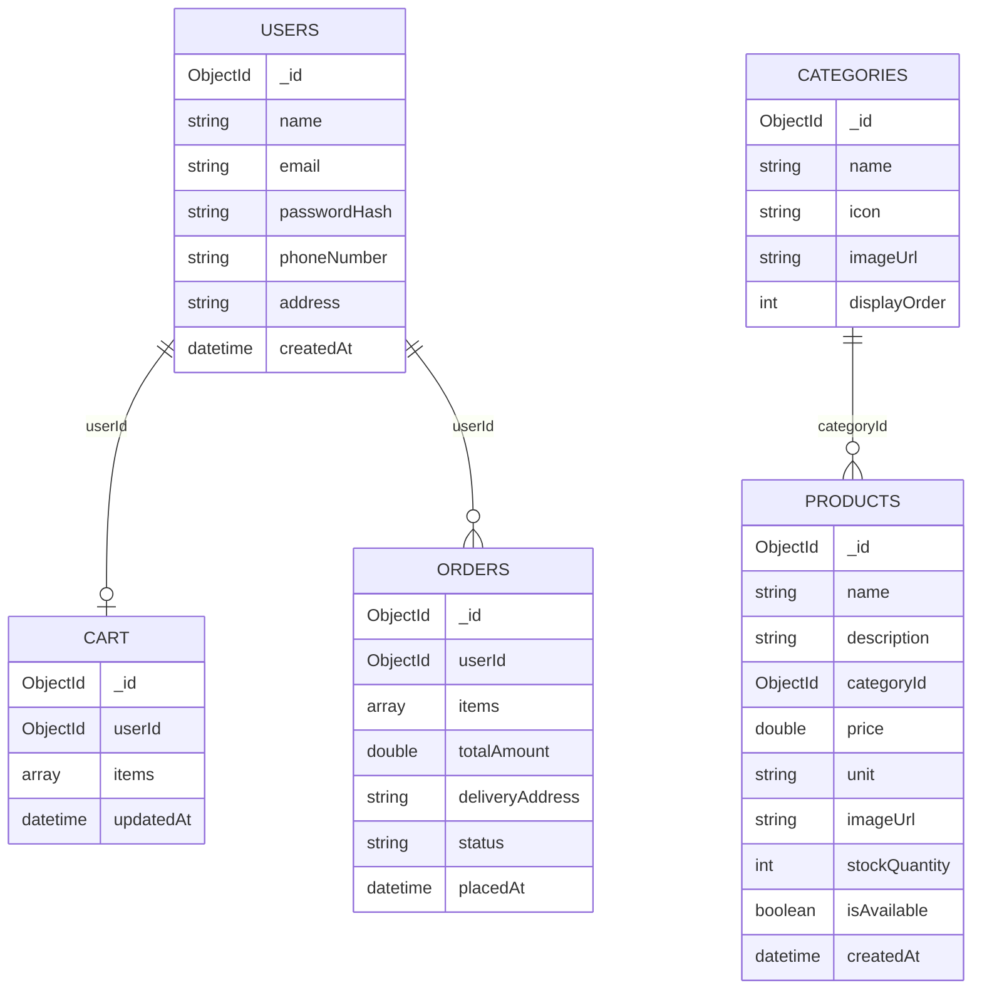
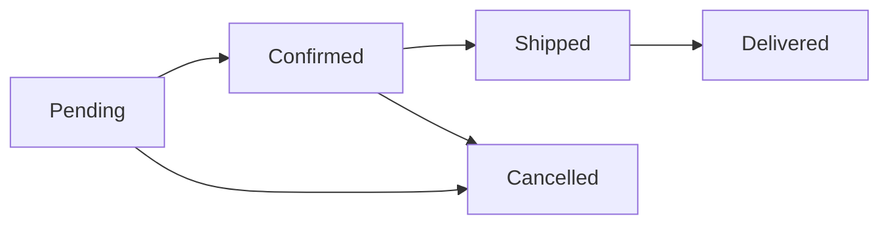

# Smart Grocery App — System Design
## 4. Database (MongoDB Atlas)

Five core collections make up the database: **Users, Categories, Products, Cart, Orders**.

### Collection Relationships

### Embedded Sub-Documents

**Cart.items[] → CartItem**

| Field | Type | Description |
|---|---|---|
| productId | ObjectId | Reference to a Products document |
| quantity | Int | Number of units selected |
| priceAtAdd | Double | Product price captured at time of add |

**Orders.items[] → OrderItem**

| Field | Type | Description |
|---|---|---|
| productId | ObjectId | Reference to a Products document |
| quantity | Int | Number of units ordered |
| price | Double | Price at time of order |

### Order Status Values

### Key Relationships Summary

- `Users.userId` → `Cart` (one cart per user)
- `Users.userId` → `Orders` (many orders per user)
- `Categories.categoryId` → `Products` (many products per category)
