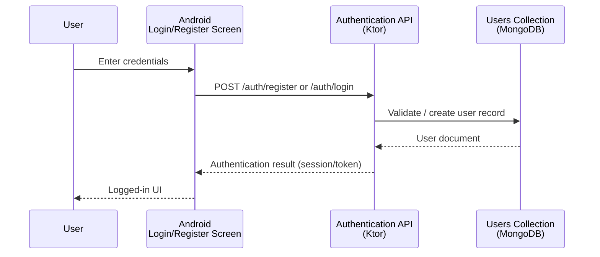
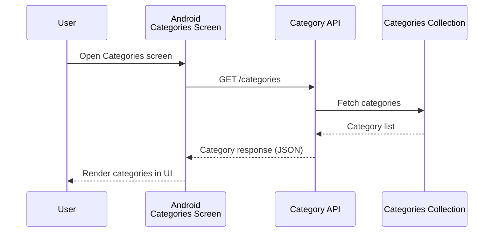
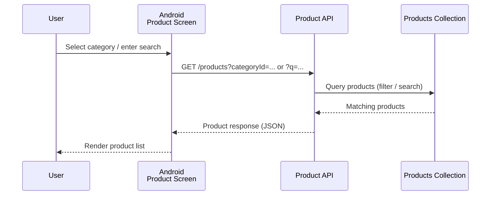
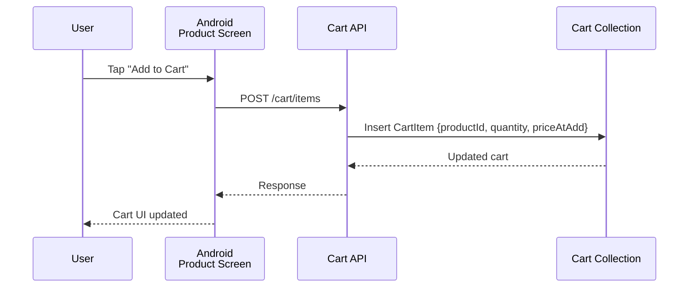
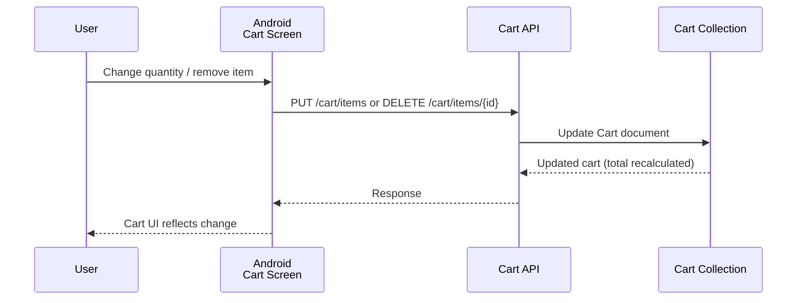
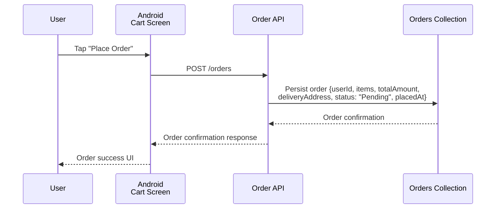
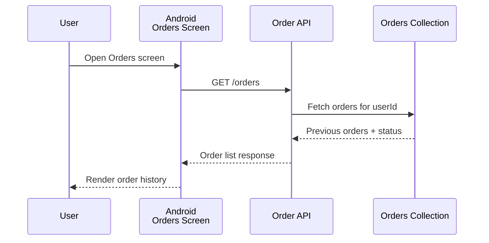
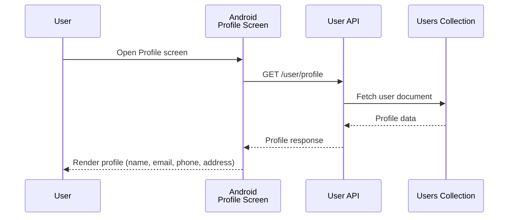
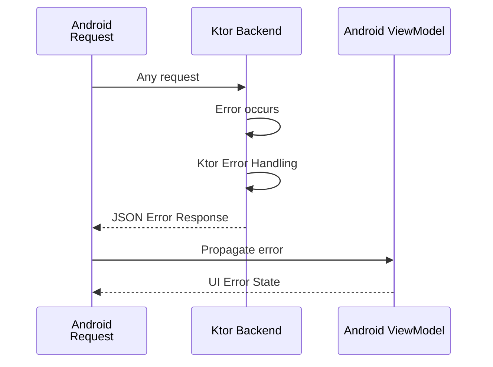

# Smart Grocery App — System Design
## 5. System Flows

Each flow shows request direction (solid) and response direction (dashed) across the
three layers: **Android Frontend → Ktor Backend → MongoDB Atlas**.

---

### Flow 1 — User Registration / Login

---

### Flow 2 — Browse Categories

---

### Flow 3 — Browse / Search Products

- **Category filtering:** Category Selection → Product API → Products filtered by `categoryId` → Android UI
- **Search:** Search Query → Product API → Product Search → Products Collection → Search Results → Android UI

---

### Flow 4 — Add to Cart

---

### Flow 5 — Update / Remove Cart Item

Supports: update quantity, remove item, automatic total price calculation.

---

### Flow 6 — Place Order

Initial order status is always **Pending**.

---

### Flow 7 — Order History / Status

Possible statuses: `Pending → Confirmed → Shipped → Delivered` (or `Cancelled`).

---

### Flow 8 — User Profile

---

### Error Handling Flow

No specific error codes are defined beyond the general error-handling path, per the
documented scope.
